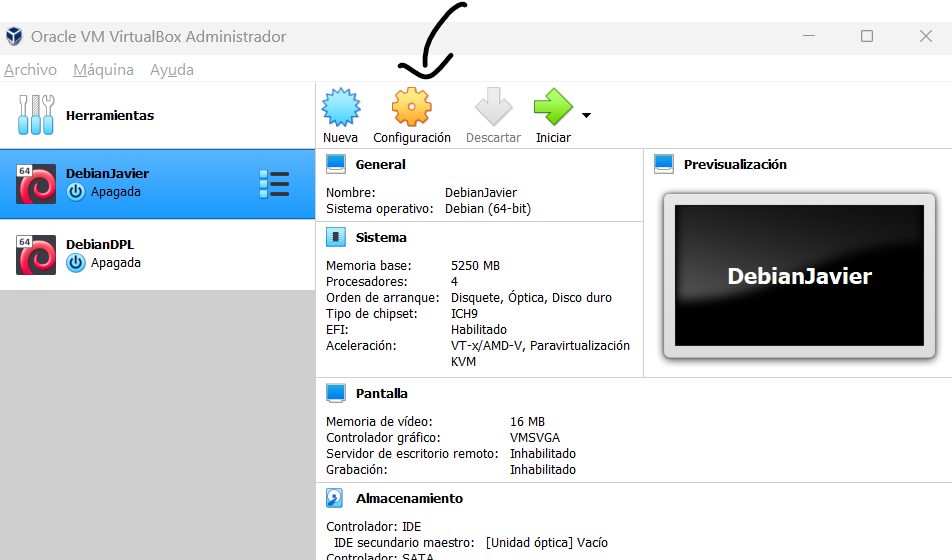
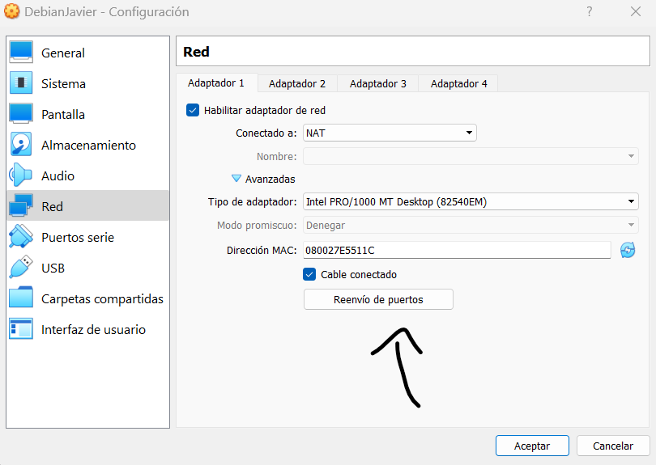
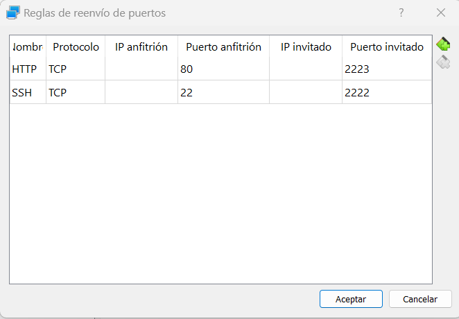

# Redireccionar puertos VirtualBox para SSH

## Paso 1

- Abre el VirtualBox, haz click en tu máquina y luego dale a configuración

## Paso 2

- Dirígete al apartado de red y dale a avanzadas. Después de eso, verás *Reenvío de puertos*

- Haces click en *Reenvío de puertos* y te saldrá la ventana de reenvio de puertos. Una vez dentro, copias como lo tengo aquí:

